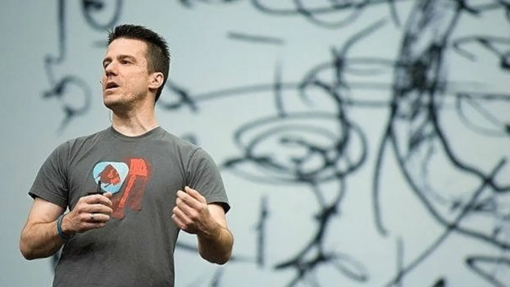
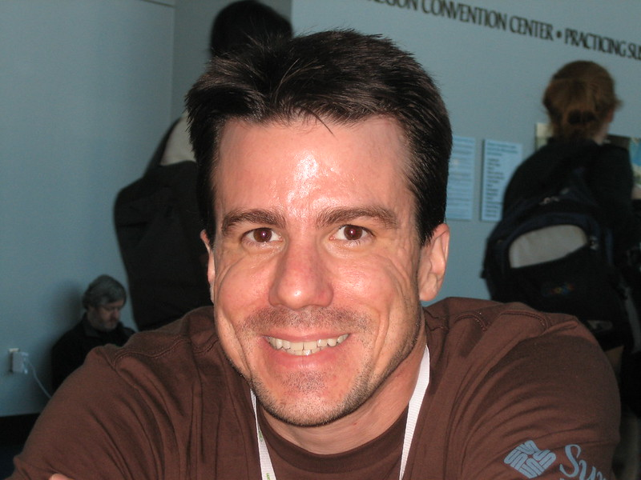
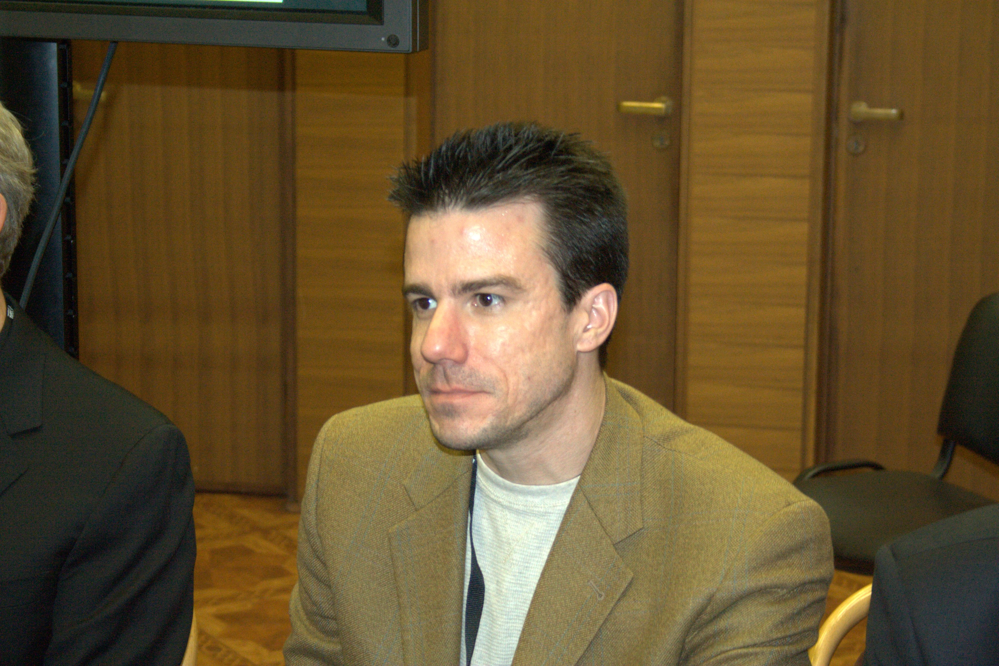

# Álbum de Fotos de Ian Murdock

Aqui apresentamos uma coleção de fotos que registram momentos importantes da vida e as contribuições de Ian Murdock para o mundo do Software Livre.

## 

**Data:** 6 de maio de 2008  
**Evento:** *CommunityOne General Session, Moscone Center, San Francisco*  
**Descrição:** Nesta foto, Ian Murdock participa da sessão geral do evento CommunityOne, realizado no Moscone Center em San Francisco. O evento reuniu desenvolvedores, entusiastas de software livre e membros da comunidade open source. Murdock, conhecido por seu trabalho no Debian e envolvimento posterior com a Sun Microsystems, destacou neste evento o papel das comunidades colaborativas no avanço do software de código aberto.

## 

**Data:** 25 de julho de 2007  
**Evento:** *OSCON (O'Reilly Open Source Convention)*  
**Descrição:** Nesta imagem, Ian Murdock está presente na O'Reilly Open Source Convention (OSCON), um dos eventos mais relevantes para a comunidade de software livre. A conferência reuniu líderes, desenvolvedores e visionários do mundo open source. Murdock, já amplamente reconhecido como fundador do Debian, compartilhou suas perspectivas sobre os rumos do software livre e sua experiência na construção de projetos colaborativos em larga escala.

## 

**Data:** 2008  
**Evento:** *Sun Tech Days, São Petersburgo, Rússia*  
**Descrição:** Nesta foto, Ian Murdock participa do Sun Tech Days 2008, um evento internacional promovido pela Sun Microsystems para engajar desenvolvedores em novas tecnologias e plataformas abertas. Na época, Murdock atuava como Vice-Presidente de Plataformas Emergentes da Sun. Durante sua apresentação, ele discutiu a importância da padronização, da interoperabilidade e do papel do software livre na construção de uma infraestrutura tecnológica acessível e inovadora.

Esta imagem mostra Ian Murdock, o engenheiro de software americano conhecido por fundar o Projeto Debian em 1993[cite: 3]. Ele foi uma figura central na comunidade Linux, contribuindo significativamente para a filosofia e o desenvolvimento de sistemas operacionais abertos. Esta foto em particular é amplamente utilizada para representá-lo.[^1]

[^1]: Fonte da foto 1: [https://commons.wikimedia.org/wiki/File:IanMurdock.jpg](https://commons.wikimedia.org/wiki/File:IanMurdock.jpg) (Licença: Creative Commons Attribution-Share Alike 4.0 International)

Esta foto apresenta Ian Murdock em um contexto que parece ser um momento mais casual ou de reflexão. A imagem permite observar detalhes de seu rosto e barba, características que o tornavam reconhecível na comunidade de software livre. Esta imagem é frequentemente usada em artigos e discussões sobre sua vida e legado [^2].

[^2]: Fonte da foto 2: [https://substackcdn.com/image/fetch/w_1456,c_limit,f_webp,q_auto:good,fl_progressive:steep/https%3A%2F%2Fsubstack-post-media.s3.amazonaws.com%2Fpublic%2Fimages%2F64d9905f-c5dc-41a1-a0d5-2d7429d2cd9e_650x487.jpeg](https://substackcdn.com/image/fetch/w_1456,c_limit,f_webp,q_auto:good,fl_progressive:steep/https%3A%2F%2Fsubstack-post-media.s3.amazonaws.com%2Fpublic%2Fimages%2F64d9905f-c5dc-41a1-a0d5-2d7429d2cd9e_650x487.jpeg)
